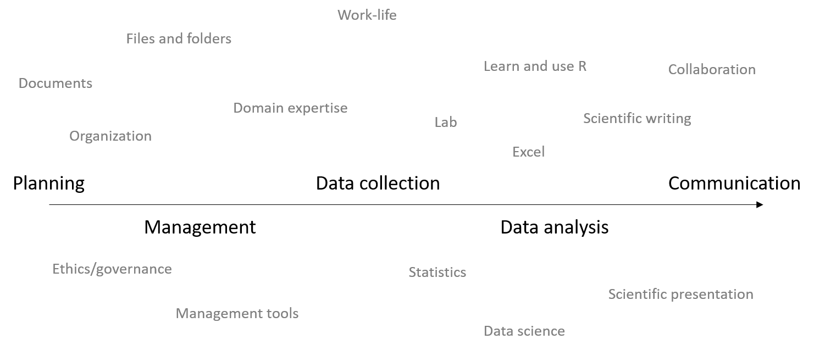

# Research seminars

In this **seminar series**, we will discuss various aspects of research.

Work related to R and RStudio will be central, but other aspects  of research are also considered, such as strategies for effective *project planning*, *project management*, *data collection*, *data analysis* and *communication*. 

## Documentation

### 2020-04-20

*Topic*: TBA

### 2020-04-14

*Topic*: RStudio cheatsheets: data transformation (`dplyr`)

### 2020-04-06

*Topic*: RStudio cheatsheets: data import (`tidyr`)

- Discussed the `read_*` functions, with emphasis on `read_csv`. 
- We can specify which type of delimiter we have with `read_delim` and the delim argument. 
- Get more info about a `readr` function with ?, like so: `?read_csv`, or at [the tidyverse documentation website](https://readr.tidyverse.org/). 
- Use `col_types = cols()` to specify column types directly in the call to the readr function. 
- Otherwise, change column types with a subsequent mutate call; you can also use some variant of purrr::modify. 
- `haven` is great to read (and write) SPSS (.sav) and STATA (.dta) files. 
- Use `read_sav` or `read_spss` to read SPSS files. 
- Check if a variable is labelled (with SPSS labels) using the `haven::is.labelled` predicate function.
- Convert from labelled SPSS variable to R factor with the `haven::as_factor` function.
- Pull out other attributes from an SPSS file/object with the `attributes` function. 
- Be careful with converting stuff to factors. Under the hood, a factor is just an integer. 
- Use `drop_na` to drop rows with missing entries, or supply a variable name to remove rows with missing entries for just that variable. 
- Replace missing entries with something using the `replace_na` function. 
- This pattern is a recurring theme: `gather`/`pivot_longer` - `separate` - `unite` - `spread`/`pivot_wider`. 

### 2020-03-30

*Topic*: Regularization with LASSO and ridge. 

- Discussed penalization principles. 
- Discussed LASSO, ridge and the standard variable selection procedures (forward/backward stepwise). 
- Trevor Hastie and Junyang Qian has [a great vignette](https://web.stanford.edu/~hastie/glmnet/glmnet_alpha.html) on the `glmnet` package. 
- Chapter six in *An Introduction to Statistical Learning - with Applications in R* by James, Witten, Hastie & Tibshirani is a great resource for the `glmnet` package and LASSO/ridge regression. 
- It is [free online](http://faculty.marshall.usc.edu/gareth-james/ISL/). 
- There are also some [available videos](https://www.dataschool.io/15-hours-of-expert-machine-learning-videos/) that can take you though the material. 
- It is somewhat unclear how we should optimally use these procedures in statistical inference. 
- They can probably be used in concert with traditional methods to select the most important variables in a larger set of potential variables. That is, a more data-driven type of variable selection (shrinkage). This would be similar to use of PCA to account for correlation between variables, although PCA doesn't retain that much interpretability. 

### 2020-03-23

- Worked through the `pivot_` functions from `tidyr`. 
- These can be very useful to take control over repeated measures. 
- They are also very effective for visualizations: 
  - Visualize distributions for multiple variables. 
  - Visualize small multiples (subsets of data over many small panels/facets)

